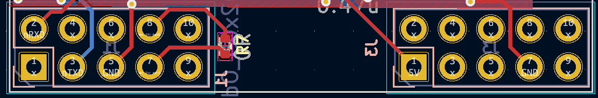
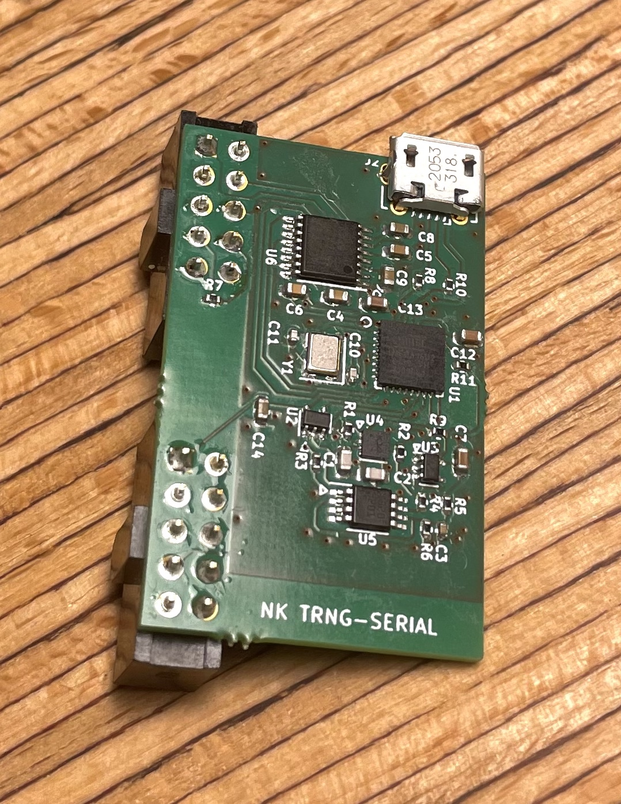

# Nitrokey TRNG RS232 Firmware

[Infnoise](https://github.com/waywardgeek/infnoise) inspired serial TRNG implementation for NetHSM

## Production

- Download the firmware from the [release page](https://github.com/Nitrokey/nitrokey-trng-rs232-firmware/releases)
- Download the dfu-upload.sh script and place it in the same folder
- Connect a device that you want to flash via USB
- Run ```./dfu-upload.sh firmware```

## Getting Started

- [Install Docker](https://docs.docker.com/engine/install/)

- Install [DFU-Programmer](https://github.com/dfu-programmer/dfu-programmer) and [ent](https://github.com/Fourmilab/ent_random_sequence_tester):
  - Linux: `$ apt-get install -y dfu-programmer ent`
  - MacOS: `$ brew install dfu-programmer ent`

## Build & Upload

Go to src directory:

`$ cd src`

### Build:

`$ make docker-build`

### Flash:

1. Get the Atmega16u2 into DFU-mode
2. `$ make dfu`

### Build & Flash:

1.	Get the Atmega16u2 into DFU-mode
2.	`$ make`

On some systems the `make dfu` command needs `sudo` privilege.

### DFU mode:

New (previously unflashed) Atmega16u2 always boot directly in DFU mode.

On development boards:
1. permanently close JP1
2. connect board over USB
3. shortly close JP2

## Connect the RS232 serial adapter

Use a RS232 serial adapter with a DE-9 port with a total of 9 pins (pin layout: 5-4).
Connect the serial adapter to the header *J1* of the TRNG, using DuPont cables.
The required pins on both sides are *GND* and *nRXD*.

* GND (TRNG) -> GND (DE-9 serial adapter: pin 5)
* nRXD (TRNG) -> nRXD (DE-9 serial adapter: pin 2)

Refer to the [hardware schematics](https://github.com/Nitrokey/nitrokey-trng-rs232-firmware?tab=readme-ov-file#hardware) to identify the correct pins on the TRNG.

## Monitor random data output

Linux:

```
$ stty 115200 raw cs8 -cstopb -parenb -F /dev/[serial device]
$ xxd /dev/[serial device]
```

MacOS:

```
$ (stty 115200 raw cs8 -cstopb -parenb; xxd) </dev/[serial device]
```

Serial device would be something like  `ttyS0` or `cu.usbserial-XXX`.

### Check entropy

With the `ent` tool the entropy can be estimated:

Linux:
```
$ dd if=/dev/[serial device] iflag=fullblock bs=1K count=100 | ent 
```

To test on Linux, make sure you run the *stty* command before.
If you already have done it in the previous step, without disconnecting the RS232 serial adapter meanwhile, you don't need to run it again.

MacOS:
```
(stty 115200 raw cs8 -cstopb -parenb; dd iflag=fullblock bs=1K count=100) </dev/[serial device] | ent
```

This should result in output similar to:

```
100+0 records in
100+0 records out
102400 bytes transferred in 9.188599 secs (11144 bytes/sec)
Entropy = 7.998317 bits per byte.

Optimum compression would reduce the size
of this 102400 byte file by 0 percent.

Chi square distribution for 102400 samples is 238.57, and randomly
would exceed this value 76.25 percent of the times.

Arithmetic mean value of data bytes is 127.5779 (127.5 = random).
Monte Carlo value for Pi is 3.140982070 (error 0.02 percent).
Serial correlation coefficient is -0.000348 (totally uncorrelated = 0.0).
```

## Hardware

The [schematic](https://github.com/Nitrokey/nitrokey-trng-rs232-hardware/blob/main/trng-serial.pdf) can be found insed the [hardware repository](https://github.com/Nitrokey/nitrokey-trng-rs232-hardware).





## [License](./LICENSE)
