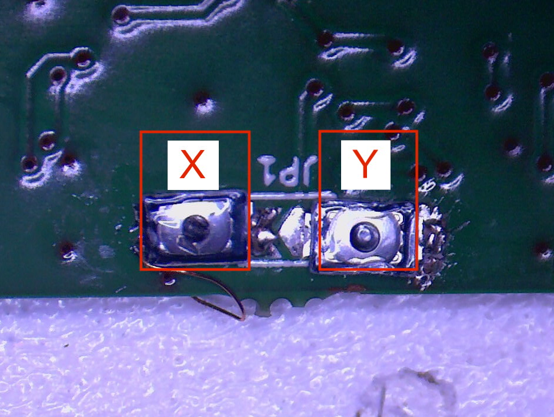
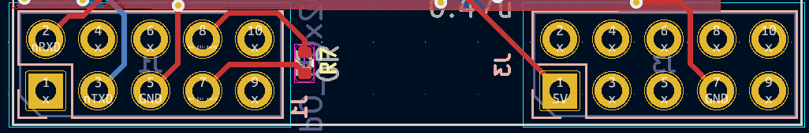
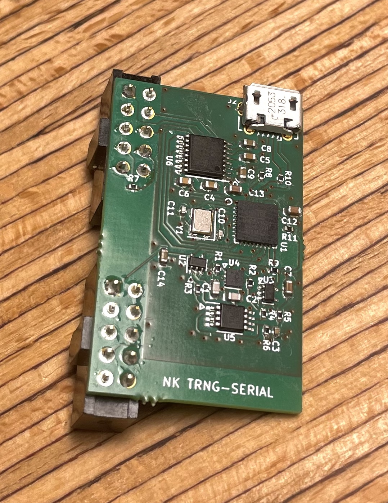

# Nitrokey TRNG RS232 Firmware

[Infnoise](https://github.com/waywardgeek/infnoise) inspired serial TRNG implementation for NetHSM

## Getting Started

- [Install Docker](https://docs.docker.com/engine/install/)

- Install DFU-Programmer:
  - Linux: `apt-get install -y dfu-programmer`
  -  MacOS: `brew install dfu-programmer`

## Build & Upload

Go to src directory: ```cd src```

#### Build:

`make docker-build`

#### Flash:

1. Get the Atmega16u2 into DFU-mode
2. `make upload`

#### Build & Flash:

1.	Get the Atmega16u2 into DFU-mode
2.	`make`

On some systems the make commands need ```sudo``` privilege.

#### DFU mode:

New (previously unflashed) Atmega16u2 always boot directly in DFU mode.

On development boards:
1. press and hold the Y button.
2. press and release the X button
3. release Y button



## Monitor random data output

1. ```stty 115200 raw cs8 -cstopb -parenb -F /dev/[device file]```
2. ```xxd -b /dev/[device file]```

e.g.: ``` device file = ttyS0```

## Hardware

The [schematic](https://github.com/Nitrokey/nitrokey-trng-rs232-hardware/blob/main/trng-serial.pdf) can be found insed the [hardware repository](https://github.com/Nitrokey/nitrokey-trng-rs232-hardware).





## [License](./src/LICENSE)

